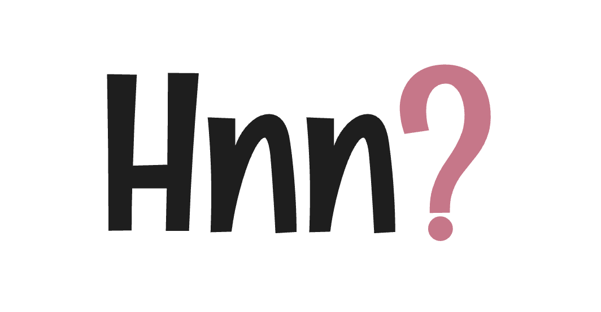
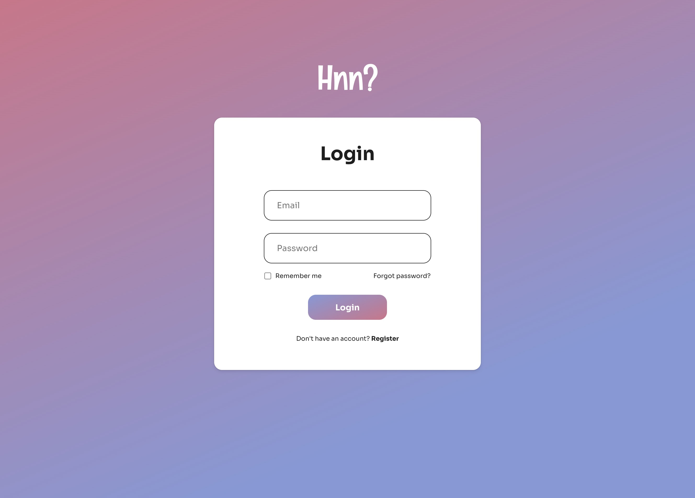
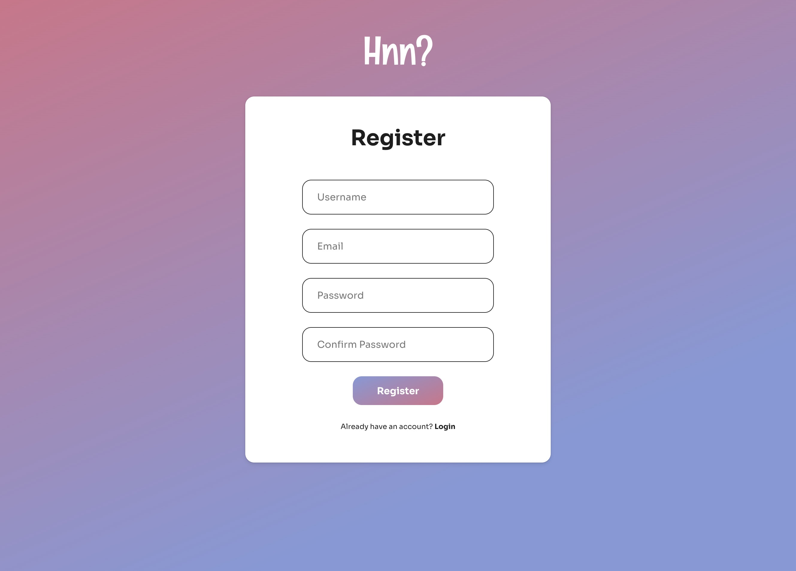
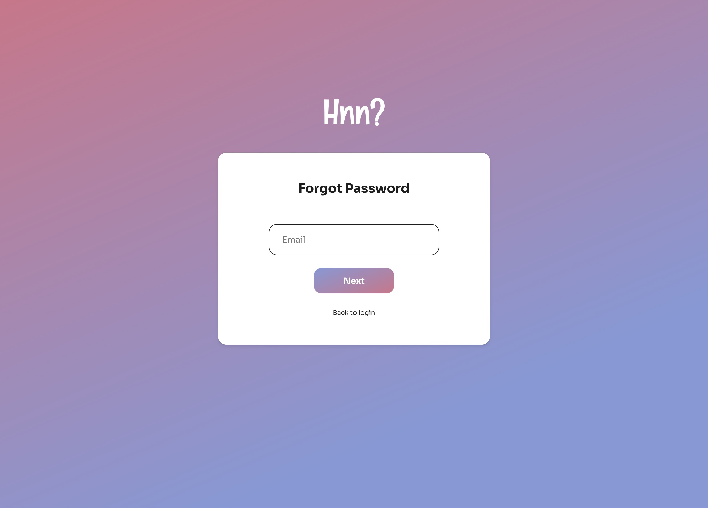
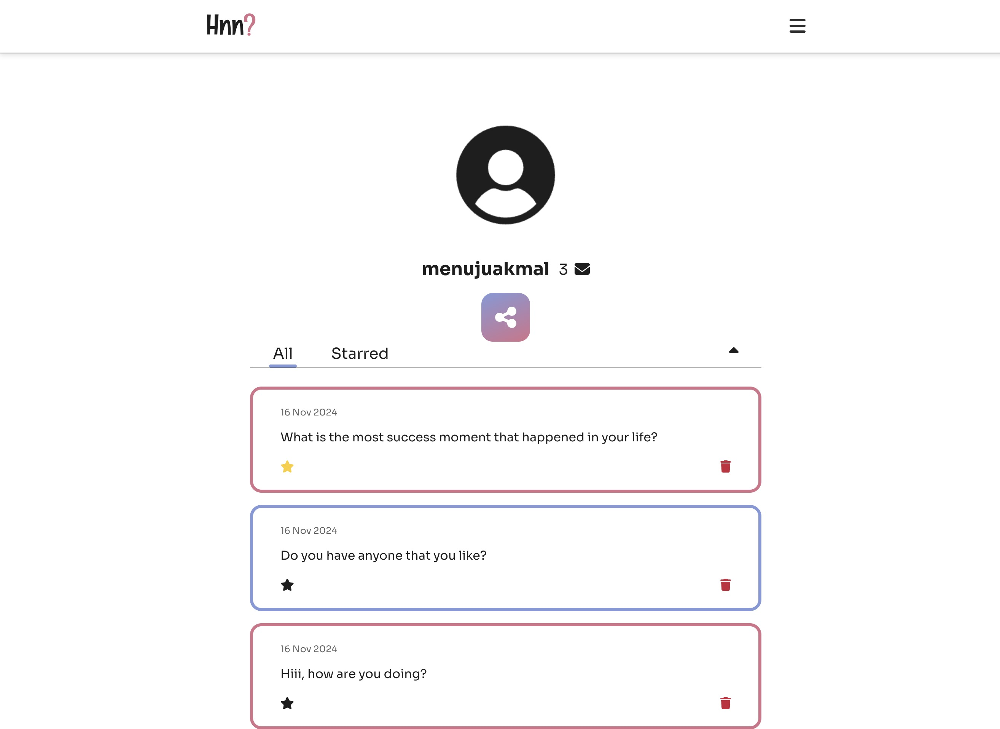
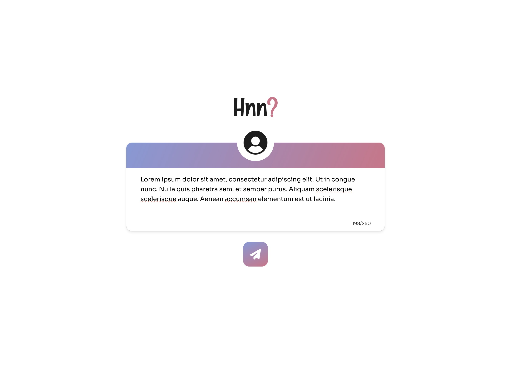
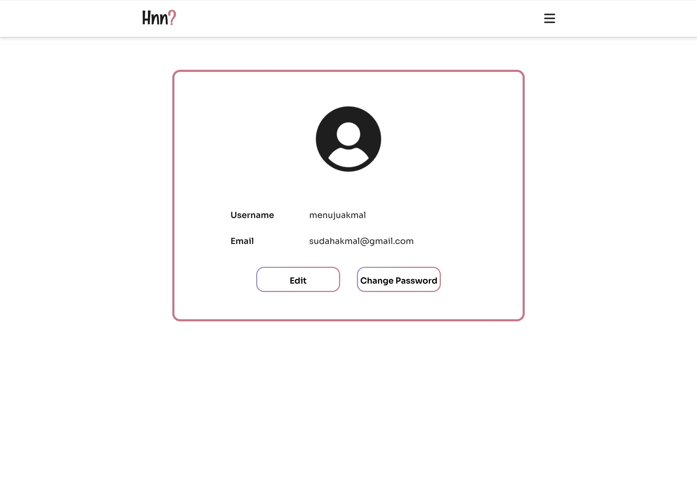

<!-- Improved compatibility of back to top link: See: https://github.com/othneildrew/Best-README-Template/pull/73 -->
<a id="readme-top"></a>
<!--
*** Thanks for checking out the Best-README-Template. If you have a suggestion
*** that would make this better, please fork the repo and create a pull request
*** or simply open an issue with the tag "enhancement".
*** Don't forget to give the project a star!
*** Thanks again! Now go create something AMAZING! :D
-->


<!-- PROJECT SHIELDS -->
<!--
*** I'm using markdown "reference style" links for readability.
*** Reference links are enclosed in brackets [ ] instead of parentheses ( ).
*** See the bottom of this document for the declaration of the reference variables
*** for contributors-url, forks-url, etc. This is an optional, concise syntax you may use.
*** https://www.markdownguide.org/basic-syntax/#reference-style-links
-->

<!-- PROJECT LOGO -->
<br />
<div align="center">
  <a href="https://github.com/AkmalArifin/anon-project">
    
  </a>

<h3 align="center">Anon Project</h3>

  <p align="center">
    Anonymous question platform with account creation, targeted messaging, and message filtering features.
  </p>
</div>


<!-- TABLE OF CONTENTS -->
<details>
  <summary>Table of Contents</summary>
  <ol>
    <li>
      <a href="#about-the-project">About The Project</a>
      <ul>
        <li><a href="#built-with">Built With</a></li>
      </ul>
    </li>
    <li>
      <a href="#getting-started">Getting Started</a>
      <ul>
        <li><a href="#prerequisites">Prerequisites</a></li>
        <li><a href="#installation">Installation</a></li>
      </ul>
    </li>
    <li><a href="#usage">Usage</a></li>
    <li><a href="#contact">Contact</a></li>
    <li><a href="#acknowledgments">Acknowledgments</a></li>
  </ol>
</details>


<!-- ABOUT THE PROJECT -->
## About The Project

Anon Project is my personal website project to deepen my full-stack programming skills. This project inspired by app called ngl in mobile phone, and I inspired to build similiar thing but in form of website.

<p align="right">(<a href="#readme-top">back to top</a>)</p>


### Built With

* [![Vue][Vue.js]][Vue-url]
* [![Go][Golang]][Go-url]
* [![MySQL][MySQL]][MySQL-url]

<p align="right">(<a href="#readme-top">back to top</a>)</p>


<!-- GETTING STARTED -->
## Getting Started

To run this project locally, you need several things to do.

### Prerequisites

Install preqrequisites app that needed to install this project.
* [MySQL][MySQL-url]
* [Node.js][Nodejs-url]
* [Golang][Go-url]
* npm
  ```sh
  npm install npm@latest -g
  ```

### Installation

1. Clone the repo
   ```sh
   git clone https://github.com/AkmalArifin/anon-project.git
   ```
2. Create new database in MySQL and import from `/backend/db.sql`
3. Create .env file from `backend` folder
4. run the server in backend folder
   ```sh
   go run .
   ```
5. go to frontend folder, and run
   ```sh
   npm install
   ```
6. run the web on local
   ```sh
   npm run dev
   ```

<p align="right">(<a href="#readme-top">back to top</a>)</p>


<!-- USAGE EXAMPLES -->
## Usage

### Login


### Register


### Forgot Password
Currently to forgot password, the link is send through console log.


### Dashboard


### Ask
To ask you got to this path `/ask/username`


### Profile


<p align="right">(<a href="#readme-top">back to top</a>)</p>

<!-- CONTACT -->
## Contact

Muhammad Akmal Arifin - [@menujuakmal](https://twitter.com/menujuakmal) - menujuakmal@gmail.com.com

Project Link: [https://github.com/AkmalArifin/anon-project](https://github.com/AkmalArifin/anon-project)

<p align="right">(<a href="#readme-top">back to top</a>)</p>


<!-- ACKNOWLEDGMENTS -->
## Acknowledgments

* [Best README Template](https://github.com/othneildrew/Best-README-Template)

<p align="right">(<a href="#readme-top">back to top</a>)</p>


<!-- MARKDOWN LINKS & IMAGES -->
<!-- https://www.markdownguide.org/basic-syntax/#reference-style-links -->
[contributors-shield]: https://img.shields.io/github/contributors/AkmalArifin/anon-project.svg?style=for-the-badge
[contributors-url]: https://github.com/AkmalArifin/anon-project/graphs/contributors
[forks-shield]: https://img.shields.io/github/forks/AkmalArifin/anon-project.svg?style=for-the-badge
[forks-url]: https://github.com/AkmalArifin/anon-project/network/members
[stars-shield]: https://img.shields.io/github/stars/AkmalArifin/anon-project.svg?style=for-the-badge
[stars-url]: https://github.com/AkmalArifin/anon-project/stargazers
[issues-shield]: https://img.shields.io/github/issues/AkmalArifin/anon-project.svg?style=for-the-badge
[issues-url]: https://github.com/AkmalArifin/anon-project/issues
[license-shield]: https://img.shields.io/github/license/AkmalArifin/anon-project.svg?style=for-the-badge
[license-url]: https://github.com/AkmalArifin/anon-project/blob/master/LICENSE.txt
[linkedin-shield]: https://img.shields.io/badge/-LinkedIn-black.svg?style=for-the-badge&logo=linkedin&colorB=555
[linkedin-url]: https://linkedin.com/in/akmalarifin
[product-screenshot]: images/screenshot.png
[Vue.js]: https://img.shields.io/badge/Vue.js-35495E?style=for-the-badge&logo=vuedotjs&logoColor=4FC08D
[Vue-url]: https://vuejs.org/
[Golang]: https://img.shields.io/badge/Go-00ADD8?logo=Go&logoColor=white&style=for-the-badge
[Go-url]: https://go.dev/
[MySQL]: https://img.shields.io/badge/MySQL-4479A1?style=for-the-badge&logo=mysql&logoColor=white
[MySQL-url]: https://www.mysql.com/
[Nodejs-url]: https://nodejs.org/en
